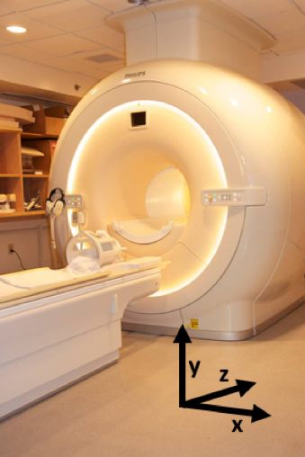

======================
The Coffee Room Answer
======================

Maybe in this case I have several minutes to bore my listener to death, but the listener is not satisfied with explanations that involve spies.  The listener might vaguely remember some high school physics or chemistry.

The process of absorption and re-emission of radio waves by nuclei is called Nuclear Magnetic Resonance (NMR), and this is the basis of MRI [#]_.

*Nuclear*
  It is the properties on the nucleus that give us the signal. In almost all MRI, the particular nucleus involved is hydrogen, which consists of a single proton.

*Magnetic*
  It is the magnetic properties of the nucleus that we manipulate in NMR and MRI. Hydrogen is one of a select few nuclei that have a magnetic moment and can give a signal. Other nuclei have very low concentrations in the body, so are rarely used.

*Resonance*
  Objects resonate when they are exposed to forces at their “natural” frequency.  Examples of resonance include guitar strings, singers breaking wine glasses with their voice, and bridges that collapse because the wind was gusting at just the wrong frequency.

In the case of NMR, in addition to its magnetic moment, the proton has property called spin, or angular momentum. The combination of angular momentum and magnetic torque (turning force) results in protons having a natural (“resonant”) frequency that depends linearly on the magnetic field in which it finds itself. It is difficult to visualize how the proton responds, but fortunately a gyroscope (or a child’s spinning top toy) is a very close analogy and undergoes a motion called precession.

The good news is that if you understand how a spinning top (gyroscope) works, you should have a pretty good idea about how a proton behaves in a magnetic field.  The bad news is that spinning tops are also really difficult to understand [#]_. On the plus side, at least you can watch a gyroscope precessing (just Google “youtube gyroscope” for examples), or spend a few dollars on one for yourself.

   A Tedco original gyroscope (gyroscope.com). You can still buy them today.

Precession
----------

Watch the videos of a gyroscope in action (yes, do it, don’t skip this bit); when the gyroscope is spinning rapidly on its axis and pointing upward, it is amazingly stable.  You can even balance the gyroscope on a string and do other tricks (until friction causes it to slow down).  This stability is the basis of gyroscopic sensors used to determine orientation, where the gyroscope provides a reference direction.

If the end of the spinning gyroscope is placed on a stand, but its axis is not vertical then another strange thing happens; it rotates relatively slowly (maybe once per second or so, much slower than it is rotating about its axis) about the vertical axis.  This motion is called precession and is caused by an interaction between the torque caused by gravity trying to pull the gyroscope over, and the gyroscope’s rotation (angular momentum).  Don’t ask me to explain it.  It’s complicated.

You may be wondering what this has to do with MRI.  Well, the protons in your body behave like little spinning compass needles. They’re not very good compass needles though, and in the magnetic field of the Earth, the magnetic force is too weak for them to align North-South [#]_.

However, if you put your body into a really strong magnetic field, then your protons will tend to align with the magnetic field and you will become magnetized (acquire a non-zero net magnetic moment). Your body becomes magnetized in a few seconds (the time that it takes for this to happen -- imaginatively called “T1” -- is something that we will return to later). Once in equilibrium, your net magnetic moment is stationary and points in the direction of the external field.

Such stationary or slowly varying magnetic fields are not very interesting because they are difficult to detect. Making the protons in your body precess like a gyroscope, on the other hand, would generate an alternating magnetic field at the precession frequency.  We can and do detect such a motion with a coil of wire (or aerial), in which we would induce a voltage through Faraday induction [#]_.

Excitation
----------

Imagine you are pushing a small child on a swing.  The swing, like a pendulum, has a natural (resonant) frequency [#]_. If you want to increase the amplitude of the swing, you must push it at the same point in the oscillation each time.  In other words, your push must be repeated at the resonant frequency of the swing.

The same is true of protons in a magnetic field. A radio wave (a type of electromagnetic wave) creates an alternating magnetic field that gives a little push on the proton each cycle. If the frequency of the radio wave matches the resonant frequency of the proton, then the oscillations will build up and the proton will move away from its equilibrium direction. As with the gyroscope, as the proton is moved off-axis, it starts to precess, again at its natural (resonant) frequency.

If we then switch off the radio wave, the protons will continue to precess, inducing a measurable signal into a receiver coil.  This is the NMR signal!

Imaging
-------

We now have a signal, but where did it come from? To form an image, we have to be able to determine the location from which the signal was generated.

The most obvious way to determine where the signal is coming from is to have a huge number of aerials surrounding the body. Those aerials closest to the source will have the strongest signals, while those furthest away will have weaker signals. This was the solution suggested by Raymond Damadian [#]_. However, it is not practicable to have enough coils to make high-resolution images this way. A more subtle way of encoding spatial information is required.

Remember the gyroscope? Now try a thought experiment: what would happen if you took the gyroscope to the moon, where gravity is much weaker than on Earth?  The torque on the gyroscope would be less and it would precess much more slowly.

The same is true of a proton. Its NMR precession frequency depends linearly on the strength of the magnetic field (which determines the magnetic torque pulling on the proton). This relationship can be written as the Larmor equation:

.. math::

   \omega = \gamma B

Where :math:`{\omega}` is the resonant frequency, :math:`{B}` is the magnetic field strength, and :math:`{\gamma}`, the gyromagnetic ratio, is a constant for a particular nucleus (for protons, the nucleus of a hydrogen atom, :math:`{\gamma}=42.58` MHz/T).

A Nobel-Prize Winning Idea
--------------------------

Prior to 1973, chemists had been using NMR to investigate the structures of organic chemicals such as proteins. They were interested in how the local chemical environment changed the NMR frequency. To measure these tiny frequency shifts, they had to make sure that the external magnetic field was as uniform as possible; a non-uniform field would give a spread of resonant frequencies, and very blurry spectra.

The amazing idea that was developed by Paul Lauterbur and Peter Mansfield can be written quite simply:

  *If we make the magnetic field vary with position in a controlled way, then the resonant frequency of the protons will similarly vary with position (via the Larmor equation). In this way, we can encode spatial location by NMR frequency, and form images.*

We’ll illustrate this with an example. Suppose we put you in an MRI scanner and switch on a magnetic field gradient in the Z-direction, which corresponds to having a slightly lower magnetic field at your feet compared to your head [#]_. Due to the Larmor equation, we can also say that the proton resonant frequency is also slightly lower at your feet, and slightly higher at your head . A radio wave of a specific frequency will only excite -- be on resonance with -- the protons in that slice of your body that happens to have the correct magnetic field. A lower frequency radio wave will be absorbed by the protons in your feet; a higher frequency one by your head. Following this *slice selective excitation*, any signal that is received back is only from this slice. We could repeat this experiment, changing the frequency each time, to generate information about the number of protons in each slice of your body from head to toe.

This example shows that we can obtain spatial information along a single direction. However, we live in a three-dimensional world, so we need three magnetic field gradient coils that we can switch on and off in sequence. Encoding the remaining two dimensions is done by changing the frequency and phase of the signal during data readout (*frequency encoding* and *phase encoding*). We will explain more about these later.

   An MRI scanner, showing the direction convention used in MRI. The Z-direction is along the axis of the main magnetic field, while X- and Y- correspond to the perpendicular horizontal and vertical axes.

We now have an idea of where the NMR signal comes from and how we can encode spatial information by using magnetic field gradients to make the resonant frequency a function of spatial location. This would be a good time to take a break, let these concepts sink in, before we go into more detail.

.. rubric:: Footnotes

.. [#] MRI was originally known as NMRI, Nuclear Magnetic Resonance Imaging.  However, when it was being developed in the 1970s, the word nuclear had particularly bad associations, and was subtly dropped from the title.

.. [#] This is a great way to embarrass a physicist; ask them how a gyroscope works using words, not equations.  Even the great physicist and Nobel-prize winner Richard Feynman – who was well known for his clear explanations – admitted that explaining the motion of a gyroscope is really difficult.

.. [#] Actually, this is not strictly true. It is possible to perform “Earth’s field NMR”.  The New Zealand physicist Paul Callaghan used this technique to study sea ice in Antarctica. Having many tons of ice as the sample makes up for the very weak magnetic field. In principle, you could image a human the same way, but it would take months. Good luck in getting your patient to stay still for that exam.

.. [#] Faraday induction is the basis of electrical generators.  If you take a coil of wire and bring a magnet up to it, the changing magnetic field generates a voltage that can be used to push current around a circuit – an electro-motive force, EMF.

.. [#] Don’t try this at home, but the resonant frequency of a pendulum is only constant for small oscillations. Swing that small child high enough and the frequency will change.

.. [#] Damadian certainly contributed to the development of MRI, but did not share the Nobel prize with Lauterbur and Mansfield. He was sufficiently upset by this apparent snub that he placed adverts in the New York Times and other newspapers making his case that he should have been included.

.. [#] There is a point at the very center of the MRI scanner called the isocenter, at which the magnetic field never changes. Current through the gradient coils causes the magnetic field to increase on one side and decrease on the other side of the isocenter.
