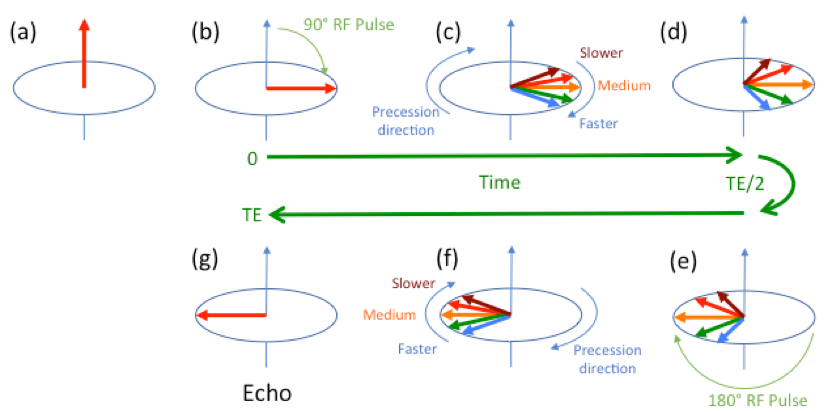

===================
Echo, echo, echo...
===================

  Echo (definition): The repetition of a sound caused by reflection of sound waves

Let’s summarize where we are. In an MRI pulse sequence, we first excite a particular slice (slice selective excitation) by switching on a magnetic field gradient in Z, and applying an RF pulse with a particular frequency and bandwidth (which determines, along with the gradient strength, the position and thickness of the slice respectively). Then we switch off the gradient in Z, and replace in with a gradient in X (the readout gradient, frequency encoding). We then switch on our sampling, measure a signal as a function of time, use a Fourier transform to convert this to a signal as a function of frequency/position, and we are left with a line scan through our object.

If you understand the preceding paragraph, congratulations, you have all the essential concepts behind imaging with MRI. Unfortunately, there are an awful lot of pesky details, which means that reality is a little more complicated

So what would happen if we did the experiment outlined above? The RF pulse would generate some net transverse magnetization, which would start to decay as the protons experience different magnetic fields – this is called T2* decay [#]_ . However, the readout gradient itself is by definition a non-uniform field, and further increases the rate of decay. So we have a signal that starts strong and rapidly decays. We can measure this signal, Fourier transform the data, and create an image.
However, the data acquired when the protons are in phase is critical. While we are waiting for the gradient to reach its plateau value, we will have missed this essential data. We can try to acquire data during this ramp-up, and this is the basis for ultra-short TE acquisitions (which is something of a specialist area).

Another problem is that when we switch on our sampling, we suddenly go from having no signal to having a very big signal. This is a “discontinuity”, or a step change in the signal. This is very bad news when we come to perform a Fourier transform. Fourier transforms assume that the signal can be decomposed into a set of sine waves and cosine waves, and it turns out that it is very difficult to represent such an abrupt change with such sine wave “basis functions”. The discontinuity introduces a particularly nasty “ringing artifact”.

We could avoid these problems if we could manipulate the signal so that it gradually appears, and then gradually disappears, with the point at which the signal reaches a maximum corresponding to a reflection (“echo”) of the original signal, just shifted in time. If we could do this, maybe we would call the time at which the echo appears the “echo time” (is this sounding familiar?).  There wouldn’t be any nasty discontinuities in our data, and our images would look great. Wouldn’t that be nice? It turns out that there are two ways to do this, a gradient echo (sometimes called a gradient recalled echo) and a spin echo. In this section we will discuss the gradient echo, and in the next section, the spin echo.

Gradient Echoes and T2* Decay
-----------------------------

A gradient echo is produced by applying a negative “dephaser” gradient before the readout gradient (which we will assume to have a positive gradient). The negative gradient will intentionally dephase the protons, but in a controlled way. The protons on the left would experience a higher magnetic field strength, and would precess faster, while those on the right would precess slower. The signal would decay away rapidly. However, if we now reverse the direction of the gradient, then those protons which were precessing faster would now precess slower, while those which were going slower would now go faster, and start to catch up.
At the point in time at which the positive and negative gradients have been on for the same amount of time (assuming they have the same amplitude), the speeding up and slowing down will cancel each other out, and the protons will be “rephased”, and a maximum in the signal strength will be seen. In practice, it is not necessary for the gradient strength to be the same; usually a stronger gradient is used for the “dephaser” gradient, but it is applied for a shorter period of time. This allows us to select a shorter echo time for a given readout gradient strength.

This idealized rephasing does not take into account any variations in the magnetic field strength that are not due to our magnetic field gradients. These phase changes will not be reversed by the gradients, and will result in a signal loss that depends on how long we wait (the echo time). This signal loss is called T2*-decay, and may be modeled as an exponential decrease of signal with time.

  **Gradient Echo – Physical Analogy**

  Imagine each proton’s phase as corresponding to the position of a runner on a track. Initially, the runners start at the same location (they are in-phase), but because they have natural differences in their speed, they will gradually separate (dephase) as the race proceeds. A gradient echo corresponds to intentionally exacerbating this effect by telling some runners to speed up, and others to slow down. We then switch our instructions, so that those who were initially asked to speed up are now asked to slow down, and vice versa. At some point in time, the initially slow runners will catch the initially fast runners, and the signals are rephased (although not entirely an echo of the starting locations, due to natural variability within each group).

The Discovery of the Spin Echo
------------------------------

In 1950 Erwin Hahn discovered that when two RF pulses were applied sequentially, a strong NMR signal (an echo) was generated some time after the second pulse. The time between the first pulse and the second was the same as the time between the second and the echo being detected. This “spin echo” provides an alternative way to “refocus” the signal to generate an echo. In this case, the rephasing is generated by the application of the second RF pulse. Before we can understand the spin echo, we need to understand a little more about the effects of RF pulses, and introduce another parameter that we can vary on our MRI scanner – the flip angle.

Flip Angles
-----------

Earlier, we saw that a 90 degree RF pulse, converted the static (longitudinal, in the direction of the main magnetic field) magnetization of the body into a transverse (perpendicular to the main magnetic field) rotating (precessing) magnetization that we can detect. This 90 degree “flip angle” was chosen to produce the maximum amount of rotating magnetization that we measure (at least in the case where we wait long enough for the magnetization to fully recover between successive RF pulses). We are not stuck with just using 90 degree pulses though, we can generate pulses that rotate the magnetization through any angle we want. To be a little bit more precise, we rotate the magnetization about an axis that is perpendicular to the long axis of the MRI scanner (the main magnetic field). For convenience we will assume that the rotation is about the Y-axis, although it could equally well be about the X-axis.

Perhaps unsurprisingly, a 180 degree flip angle RF pulse rotates the magnetization through 180 degrees. Where this leaves the magnetization depends on where the magnetization was pointing before the pulse. If it was initially pointing in the +Z direction, afterwards it would be pointing in the opposite direction, −Z. If it was pointing in the +X direction then afterwards it would be pointing in the –X. If it was pointing in the +Y direction, then afterwards it would be pointing… in the same direction. Remember, we are rotating the magnetization about the Y-axis.

Why do we get a Spin Echo?
--------------------------

Now let’s consider applying two pulses sequentially, a 90 degree pulse followed by a 180 degree pulse. The 90 degree pulse rotates the magnetization from the Z-direction (Figure a) to the Y-direction (Figure b). As we saw with the gradient echo, natural variations in the local magnetic field strength result in changes in the resonant frequencies of protons, causing them to get out of sync with each other (Figure c, d). After a few million rotations, the proton’s magnetization directions have spread out, resulting in a progressive loss of signal.

Now we apply our 180 degree RF pulse. This (almost) instantaneously flips the protons to the opposite position in X (figure e). Remember, the Y component is unchanged because we are rotating the magnetization about the Y-axis. Those protons that were precessing faster are now behind those that were precessing slower. Now the faster precessing protons start to catch up with the slower ones (figure f). After the same amount of time after the 180 degree pulse as the 90 degree pulse was before it, the protons all get back into sync (figure g), and we get the maximum amount of signal. The proton phases are now an “echo” of the original phases. By convention, the time of this echo relative to the 90 degree pulse is called the echo time, TE, and the 180 degree pulse is applied at a time TE/2.

  Generation of a spin echo using a 90 degree RF pulse followed by a 180 degree RF pulse. Prior to the 180 degree pulse, the protons dephase. The 180 degree pulse results in the protons precessing faster being behind those going slow. When they catch up, the protons are all back in sync and a strong signal (echo) is generated.

With a spin echo such as this, we are using RF pulses to generate the echo and, unlike the gradient echo, we do not have to use the magnetic field gradients. In fact spin echoes are used in NMR experiments in systems that may not even have magnetic field gradient coils.

Spin Echoes vs. Gradient Echoes, T2 vs. T2*
-------------------------------------------

We have learned that a gradient echo is formed by deliberately using magnetic field gradients to dephase the protons, and then opposite magnetic field gradients to rephase them. A spin echo can use the natural variations in the magnetic field (on either a macroscopic or microscopic level) to dephase the signal, and then use the 180 degree pulse to bring them back into alignment. In both cases, the maximum signal is generated at the echo time, TE.

It seems as if a spin echo should give the same amount of signal, irrespective of the echo time, since it corrects for magnetic field variability. This property is useful in that spin echo MRI is much less sensitive to poor magnetic field uniformity (for example close to bone or metallic implants, or with a really non-uniform B0-field) than gradient echo MRI. However, we have assumed that any magnetic field variations are static, and are identical before and after the 180 degree pulse. In reality this is not the case; molecular motion results in rapidly fluctuating microscopic magnetic fields that are not accounted for. These molecular motions are very different for different tissue types, resulting in different rates of signal loss. If we make the TE long, then we are especially sensitive to these effects. The characteristic time for this signal loss is the T2 relaxation time of the tissue.

  **Spin echo – Physical analogy (with a bit of Star Trek)**

  As with the gradient echo analogy, we imagine each proton’s phase as corresponding to the position of a runner on a track. Initially, the runners start at the same location (they are in-phase), but because they have natural differences in their speed, they will gradually separate (dephase) as the race proceeds. At a certain time after the start of the race (TE/2) we use the transporter from the Starship Enterprise to zap each runner to the opposite side of the track such that those who were at the front of the pack find themselves at the back and vice versa. Assuming everyone keeps running at the same speed, they will all catch up with each other an equal amount of time after the use of our transporter, as they had to run before being zapped.

  There is another often-used analogy that describes the effect of the RF pulse to turn the runners around, resulting in all the runners returning to the start line at the same time. I dislike this analogy because it gives the impression that the precession direction has changed, which it certainly does not. The advantage of this explanation though is that it doesn’t rely on Star Trek technology.

Gradient echoes are sensitive to these fluctuating magnetic fields, but are also sensitive to static magnetic field variations. This combination of effects is called T2* relaxation, with T2* necessarily faster than T2. T2* depends on both the microscopic and macroscopic field uniformity, so is much less on an intrinsic tissue property than T2. However, one person’s artifact is another person’s signal; blood products containing iron produce very nonuniform fields and signal loss that can be used to identify veins and bleeds; magnetic field variations due to varying blood oxygenation level measured using gradient echo T2*-weighted images are the workhorse of functional MRI brain imaging.

*In summary, spin echo images use RF pulses to generate an echo, and are sensitive to only time-varying microscopic magnetic field fluctuations. The resulting T2-weighted images represent an intrinsic property of the tissue. Gradient echo images use magnetic field gradients to generate an echo, and are sensitive to both static and time-varying magnetic fields. The resulting T2\*-weighted images represent a combination of microscopic and macroscopic properties that may be useful for identifying materials such as blood products and blood oxygenation (functional MRI).*

.. rubric:: Footnotes

.. [#] We will discuss the difference between T2 and T2* in the next section. For the impatient, gradient echo scans produce T2* weighting, while spin echo scans produce T2 weighting.
