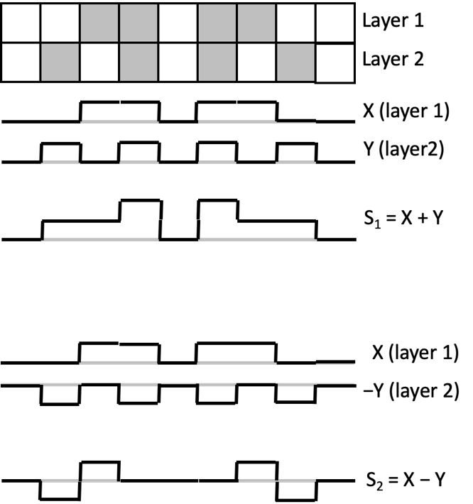

============================
Entering the Third Dimension
============================

So far, we’ve mainly ignored the fact that we live in a three-dimensional world. Instead we’ve looked at two-dimensional examples where we can use a combination of slice selection (using a magnetic field gradient during RF transmission to selectively excite a single slice) and frequency encoding (using a magnetic field gradient during signal sampling to separate the received signals by location).

To get at information about the third dimension, we encode that information in the phase of the signal. This process is called *phase encoding*. Conventionally, phase encoding is used in the y-direction.

Phase Encoding
--------------

What would happen if we switch on a magnetic field gradient in the y-direction for a short amount of time between the slice selective excitation and the frequency-encoded readout? During this short period, the magnetic field varies depending on the strength of the magnetic field gradient GY, and the location Y.

.. math::

   B(Y) = B_0 + G_Y Y

If the magnetic field is a function of Y, then so is the Larmor frequency.

.. math::

   \omega (Y) = \gamma B(Y) = \gamma (B_0 + G_Y Y)

If we take the resonant frequency of a proton at the isocenter of the magnet (where X, Y, and Z are all zero, and :math:`{\omega = \gamma B_0}`) as our reference, the change in frequency is simply

.. math::

   \Delta \omega (Y) = \gamma G_Y Y

The resonant frequency varies linearly with location, and those protons with greater values of their Y-location will get ahead of those with smaller values of Y. How far ahead does each proton get, compared to its peer at the isocenter? It depends on how much faster it’s precessing (:math:`{\Delta \omega}`), and the duration of application of the gradient (:math:`{\Delta t}`). The relative phase :math:`{\theta}` that is accumulated is simply the product of these terms. This is equivalent to saying that the distance you have driven is the product of your speed and the time you’ve been driving.

.. math::

   \theta (Y) = \Delta \omega (Y) \Delta t = \gamma G_Y Y \Delta t

We now have a signal phase that depends linearly on the position, Y.

Is this enough? When we read out our data, the X-location is encoded in the frequency, and the Y-location in the phase. Sadly, this is not enough information to reconstruct a two-dimensional image. Imagine the situation where we have two protons at the same X-location (they have the same frequency), but different Y-locations (they have different phases). When we add together two sine waves with the same frequency but different phases, we end up with a single sine wave with a phase in the middle. We can’t tell if the signal that we received is from two protons or one.

There is a way around this problem, but it’s going to cost us. That cost is time. Instead of making a single measurement with a single gradient strength Gy, we can make multiple measurements with different gradient strengths to resolve this ambiguity [#]_ .

We’ll illustrate this by considering the simplest case, where we only have two possible locations in the y-direction. We will make two measurements with different phase encode gradient strengths.

  Simplified example of phase encoding. Two measurements are made, the first (S1) in which the signal from the top and bottom layers are in-phase; the second (S2) where a magnetic field gradient has been used to invert the signal from the bottom layer. Combining these measurements allows us to separate out the signals from the two layers.

If we make a first measurement where the signals from the two layers are in phase, the signal that we measure is just a sum of the signals from each layer (we have already applied the Fourier transform such that we have a signal as a function of position, X).

.. math::

  S_{In-Phase} (X) = S_{Layer1} (X) + S_{Layer2} (X)

We then repeat the measurement, but making the phase encode gradient and duration such that the signal from the second layer is inverted (it has a phase of 180 degrees). This new out-of-phase measurement will give a signal:

.. math::

  S_{Out-Of-Phase} (X)=S_{Layer1} (X) - S_{Layer2} (X)

We now have two measurements, and we need to calculate the individual contributions from each of the two layers. This is essentially the mathematical problem of solving two equations with two unknowns.

.. math::

  S_{Layer1} (X) = \frac{1}{2} (S_{In-Phase} (X) + S_{Out-Of-Phase} (X))

  S_{Layer2} (X) = \frac{1}{2} (S_{In-Phase} (X) - S_{Out-Of-Phase} (X))

In general, if we want to disentangle n locations in the y-direction, then we need to make n measurements with different phase encode amplitudes so that we end up with the same number of unknowns as equations.

This is a reason why MRI is slow. For a conventional acquisition, to generate an image with a resolution of ny in the phase-encode direction, we need to make ny measurements, each taking a time TR. The total scan time is then simply the product of ny and TR. There are ways of speeding up this process, such as making assumptions about the signal (“Partial Fourier”), getting information about the spatial distribution of signal based of different coil element sensitivities (“SENSE” and “GRAPPA”), and acquiring data from multiple slices in a single TR (interleaved scanning).

.. rubric:: Footnotes

.. [#] Instead of changing the gradient strength, we could change its duration, although this might lead us to using different echo times for different acquisitions, allowing T2 and T2* decay to complicate matters
