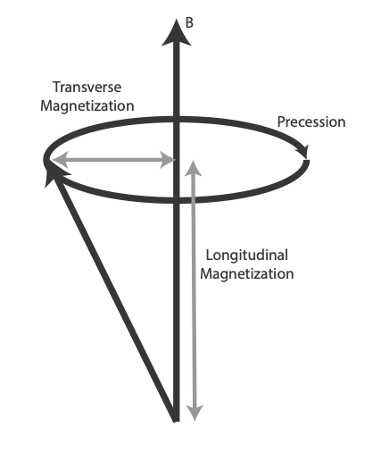
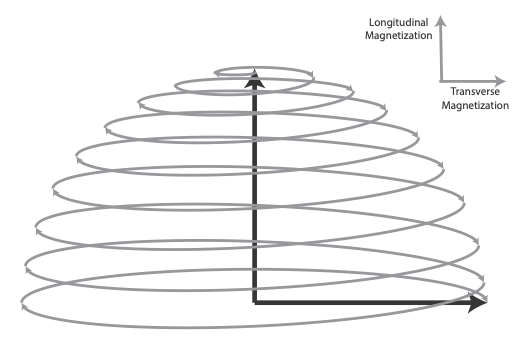
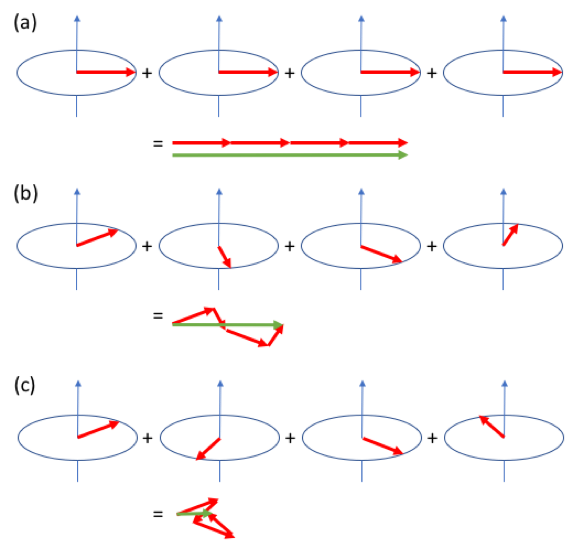
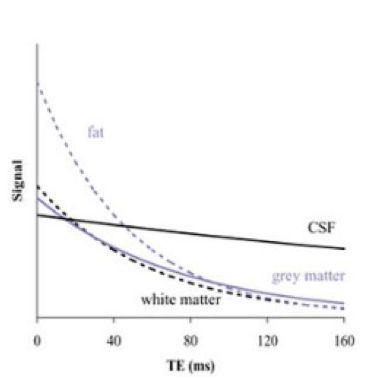
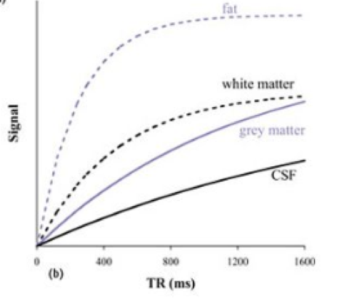

===============
Contrast in MRI
===============

**Warning: May contain some physics stuff**

At this point, we can consider the contrast in the MR image and the spatial localization as two independent parts of the MRI measurement. It is not necessary to understand one to understand the other. Taking a historical perspective, the tissue parameters that determine contrast in an MRI image (for example proton density, T1 and T2) were well understood a long time before the conception of imaging by Lauterbur and Mansfield. On the other hand, understanding the concepts behind spatial localization in MRI applies equally well to any type of contrast.

One of the magical things about MRI is that we can tweak the acquisition parameters to generate an amazing range of different contrasts. Even better, the signals from different tissue types can be very different, giving us intrinsically strong soft-tissue contrast (bones don’t contain much hydrogen and are usually not so good). Compare this with X-ray imaging, where the X-ray attenuation difference between (for example) white matter, grey matter and cerebrospinal fluid (all the stuff in your skull) differ by about 1%.

Where does this contrast come from? The most obvious source of contrast is due to the differing concentrations of hydrogen nuclei. Images with this type of contrast are known as proton density (PD) weighted images. PD-weighted images often don’t have very much signal variation between different tissue types, and have limited utility for medical imaging.

How else can we generate contrast? We will start by looking at two types of contrast that are based on the intrinsic magnetic properties of different tissue types.  These two contrast types are based on two characteristic magnetic relaxation rates, whose characteristic times (similar to a radioactive half-life) have been imaginatively named T1 and T2. Images whose contrast is primarily determined by these relaxation rates/times are known as T1-weighted and T2-weighted images respectively. To understand T1 and T2, we must learn a bit more about *spin physics*.

Spin Physics
------------

In the MRI world, the word spin is often used interchangeably with proton (which itself is sometimes used interchangeably with hydrogen). There are other nuclei that possess spin, as do electrons [#]_, but for our purposes we can equate a spin to a proton. A collection of spins gives a measureable magnetic moment, the magnetization.

   Longitudinal and transverse magnetization.

To describe the magnetic state of an object, we refer to its longitudinal and transverse magnetization (Figure 2). Longitudinal magnetization is the component of the magnetization in the direction of the main magnetic field. Transverse magnetization is the component perpendicular to the main magnetic field, and it is this component that precesses at the Larmor frequency, generating a measurable signal. It makes more sense to talk about a transverse component than X- and Y-components because as the magnetization precesses, its direction rotates, sometimes towards the X-axis, and other times towards the Y-axis.

A non-ferromagnetic object has no net magnetization in the absence of an externally applied magnetic field, so both the transverse and longitudinal components are zero. When we put that object into the strong magnetic field of an MRI scanner, it will become magnetized in the direction of the field, giving it a longitudinal magnetization.

Applying an alternating magnetic field (a radio wave) at just the right resonant frequency allows us to push the magnetization away from the longitudinal direction (similar to pushing on a child’s swing). The total angle that we push the spin away from its axis (the direction of the main magnetic field) depends on the amplitude and duration of the radiofrequency (RF) pulse that we apply. This angle is called the flip angle, and the short radio wave that we use is called a radiofrequency (RF) pulse.

   A 90 degree RF pulse converts all the longitudinal magnetization to transverse magnetization

We commonly use a flip angle of 90° to rotate the magnetization from the longitudinal direction to the transverse plane. This gives us the maximum transverse magnetization. It is only the transverse component that we can measure, so a 90° flip angle gives us the maximum signal.

Following the “90° RF pulse”, we have a large precessing magnetization generating lots of lovely NMR signal. All good things must come to an end, and the signal dies away rapidly. Likewise, the longitudinal magnetization, which is zero following the RF pulse, recovers back to its equilibrium, somewhat more slowly. The loss of transverse magnetization is termed T2- or T2*-decay (for the moment we will refer to these processes as simply T2-decay. Later we will discover the distinction between the two, and how we can make our signal sensitive to one or the other), and the recovery of longitudinal magnetization is termed T1-recovery. It is important to recognize that T1-recovery and T2-decay are separate physical processes, and that the total (net) magnetization is not constant.

T2 decay
--------

After the application of an RF pulse, some (all in the case of a 90° pulse) of the magnetization is rotated into the transverse plane. If we remember that the magnetization is the sum of the signals from all the protons (spins) in the object, then to generate a net transverse magnetization, their precessions must be synchronized; if their phases were random then the signals would just cancel each other out. Another way of saying this is that the spins have phase coherence.

If every proton precessed at precisely the same frequency, then they would maintain this phase coherence. However, the magnetic field is not completely uniform, either on a macroscopic or microscopic scale. From the Larmor equation, variations in magnetic field give variations in resonant frequency, which cause the spins to get out of sync with each other (dephase). Dephasing results in a loss of net magnetization, and a rapid decay of signal with time. This is called T2-decay, and the decay rate depends on the uniformity of the magnetic environment that the spins find themselves in.

   Dephasing resulting in T2-decay. (a) Immediately following a 90 degree RF pulse, the proton spins are in-phase, and adding their signals together as vectors results in a large net magnetization (green arrow). (b) Some time later, because of their different precession frequencies, the protons start to get out of phase with each other, and their vector sum is reduced. (c) Eventually the phases become randomly distributed, and the net magnetization approaches zero. Generally, this T2-dephasing occurs faster than the recovery of longitudinal magnetization (T1-recovery – see below).

For protons in pure water (or CSF), any one proton sees a very similar magnetic environment to any other proton, and T2-decay is very slow (a couple of seconds). On the other hand, in fat, the chemical and magnetic environments can be very different from one place to another, and the T2-decay is very fast (less than 100ms).

T2-weighted Images
------------------

Making our MRI scan more or less sensitive to T2-decay is straightforward; the longer we wait between the RF pulse and measuring the signal (this is known as the echo time, TE), the more sensitive we are to the effects of T2-decay. If we select a short echo time of (say) 10ms, then none of the tissues will have undergone much T2-decay, and we will have little T2-weighting in our image. On the other hand, if we select an echo time of 200ms, then the signals from many tissue types will have decayed a lot, while the signal from CSF will only have decayed a little. In this case, we will generate a heavily T2-weighted image, with CSF appearing characteristically bright compared to other tissue types.

  T2-weighted signal for different tissue types vs echo time, TE. For long echo times, CSF is relatively bright because of its slow T2-decay.

T2-decay is sometimes referred to as spin-spin coupling, because it is based on dephasing between spins. The characteristic time for the signal to be reduced by a factor of 1/e is called the T2 time.

T1 Recovery
-----------

We now know that following the RF pulse, the transverse magnetization decays away rapidly. This is caused by dephasing, but does not mean that the longitudinal magnetization recovers equally rapidly.

The protons absorb energy from the RF pulse, and must dissipate this energy if they are to return to equilibrium. This dissipation occurs by generating vibrations in the surrounding material, and this is called spin-lattice coupling. If the surrounding lattice is very good at absorbing energy at the Larmor frequency, then T1-recovery will be rapid; if it is very poor then T1-recovery may take several seconds.

T1-weighted Images
------------------

MRI is generally a very slow imaging modality, and one of the reasons for this is that we have to take many measurements to form an image. Many measurements suggests that we need many RF pulses. How long should we wait between one RF pulse and the next? This parameter is called the repetition time, TR.

If we want to get the maximum amount of signal, then we should wait until the magnetization from all tissues has fully recovered between measurements. In such a case, the actual T1-value will have little effect on the signal.

On the other hand, if we make the TR short, then tissues whose magnetization recovers rapidly (short T1-values) will generate more signal on the second and subsequent measurements than those which recover more slowly (long T1-values). Using a short TR results in images than are sensitive to the T1-recovery of each tissue type. Such images are referred to as T1-weighted images.

  T1-weighted signal for different tissue types vs repetition time, TR. Due to its slow recovery of longitudinal magnetization, CSF appears dark on a T1-weighted image with a short TR.

Basic MRI Contrasts: Proton Density, T1 and T2-weighted Images
--------------------------------------------------------------

We’ll now try to summarize what we’ve learned about contrast in MRI. We have two machine parameters that we can change; the time between the RF pulse and the measurement, the echo time, TE; and the time we wait between one acquisition and the next, the repetition time, TR.

  If we make the TE short and the TR long, we don’t allow much time for T2-decay, but we do wait for the magnetization of all tissues to fully recover, irrespective of the value of T1. In this case we are not very sensitive to either T1 or T2, and the resulting image is primarily sensitive to just the number of protons generating the signal. This image is called a proton density (PD) weighted image.

  If we reduce the TR, while keeping the TE short, different tissues will recover different amount of magnetization between successive acquisitions, depending on their T1 value. Such and image will be T1-weighted.

  If we make the TE long then we become sensitive to the different T2-decay constants of different tissues, resulting in a T2-weighted image. Usually T2-weighted images are generated using a long TR to minimize T1-weighting. A combination of long TE and short TR would give a mixed T1 and T2 contrast.

In reality, the signal always depends on the number of protons, so every image is sensitive to proton density. The TE is never zero [#]_, so there is always some T2-weighting. The TR can never be infinitely long, so there is always some T1-weighting. Nevertheless, we can say that proton density weighted images are primarily sensitive to proton density, T1-weighted images are primarily sensitive to T1, and T2 weighted images are primarily sensitive to T2.

We can summarize this in the table below.

.. table:: Combinations of TE and TR give the three basic contrasts for MRI

  ===== ===== ==============
  TE      TR     Contrast
  ===== ===== ==============
  Short Long  Proton density
  Long  Long  T2-weighted    
  Short Short T1-weighted    
  Long  Short Mixed          
  ===== ===== ==============

TE and TR: What is Short and What is Long?
------------------------------------------

What do we mean by a long TE or a short TR? It is their values relative to the corresponding T1 and T2 relaxation times of the tissue being imaged that determines if they are considered short or long. If TE is a lot smaller than T2 (say half or less), then we call it a short TE, otherwise it’s long (giving T2-weighting). Similarly, if the TR is substantially bigger than the T1 (perhaps double or more) then that is considered long, otherwise it’s short (giving T1-weighting).

  **The MRI Signal Equation – Warning, math!**

  Under certain conditions and assumptions, the strength of the MRI signal for each tissue type can be calculated.

  .. math::

    S = M_0 sin(\alpha) \frac{1 - E_1}{1 - cos(\alpha) E_1} e^{-\frac{TE}{T_2}}

  where :math:`{E_1 = e^{-\frac{TR}{T_1}}}` and :math:`{\alpha}` is the flip angle (which is not necessarily 90 degrees. We’ll come to this later).

  If TR>>T1 then :math:`{E_1 = e^{-\frac{TR}{T_1}} \approx 0}`, and doesn’t vary much with the precise value of T1 (i.e. little T1-weighting)

  Similarly, if TE<<T2 then :math:`{e^{-\frac{TE}{T_2}} \approx 1}`, and doesn’t vary much with the precise value of T2 (i.e. little T2-weighting)

  I didn’t just include this equation to frighten you (that’s just a bonus). The important point to take from this is that the signal intensity depends on the proton density (the equilibrium magnetization, :math:`{M_0}`), and the ratios :math:`\frac{TR}{T1}`  and :math:`\frac{TE}{T2}`. 

What’s Bright and What’s Dark?
------------------------------

We now have enough information to understand the contrast in an MR image based on the T1 and T2 values for each tissue type. Values for common tissue types are listed in Table 1.

Consider the three head images shown in Figure 2. The main tissue types that we can identify in the image are white matter, grey matter, cerebrospinal fluid (CSF) and fat.

  On the proton density weighted image, there is little contrast.

  On the T1-weighted image, CSF is dark because it has a very long T1 value (compared to the TR), so its magnetization recovers very little between one acquisition and the next. Grey matter is similarly darker than white matter because it has a longer T1 value. Fat is brightest because of its short T1.

  On the T2-weighted image, CSF is bright because its signal decays slowly following the RF pulse. Grey matter is brighter than white matter because of its somewhat longer T2 value. Fat is darker due to its short T2.

.. table:: T1- and T2-values of various tissue types (at 1.5T and 3.0T, from Stanisz et al, MRM 54:507-512, 2005, Gold et al, AJR 183:343 2004). The magic of MRI is that these values vary widely between tissue types, giving MRI very high intrinsic contrast.

  ========================= ======= ======= ======= =======
  Tissue Type               T1 (ms) T2 (ms) T1 (ms) T2 (ms)
  ========================= ======= ======= ======= =======
  Grey matter (GM)          1124    95      1820    99 
  White matter (WM).        884     72      1084    69
  Cerebrospinal fluid (CSF) 2400    160     3120    160
  Skeletal muscle           1008    44      1412    50
  Subcutaneous fat          288     165     371     133
  Blood                     1441    327     1932    275
  ========================= ======= ======= ======= =======
  

.. table:: Basic image weightings

  ==================================== ==================================== ====================================
  Proton Density                       T1-weighted                          T2-weighted
  ==================================== ==================================== ====================================
  .. image:: images/proton-density.png .. image:: images/T1w.png            .. image:: images/T2w.png
  TE/TR = 27/3000 ms                   TE/TR = 10/600 ms                    TE/TR = 100/4392 ms
  ==================================== ==================================== ====================================

.. rubric:: Footnotes

.. [#] I did my DPhil in the field of electron spin resonance. It’s less interesting than it sounds. Or probably just as interesting as it sounds.

.. [#] Although the TE can be made very short. The development of ultrashort TE (UTE) acquisitions is a topic of active development.
