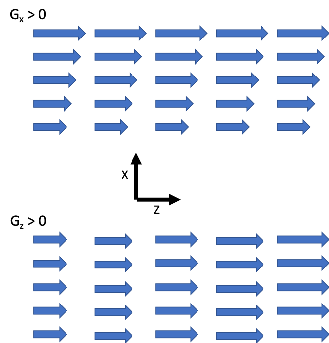
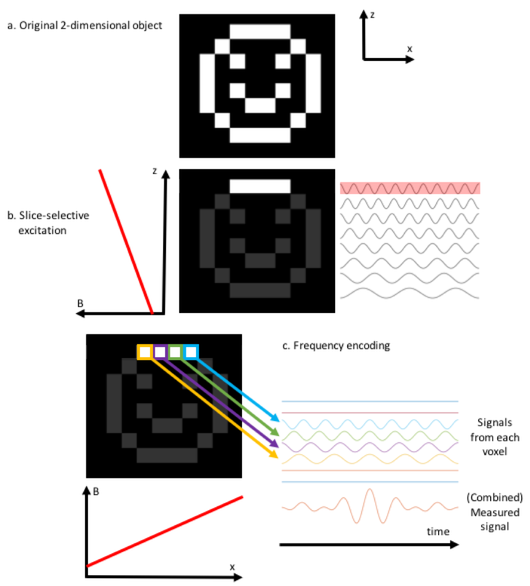
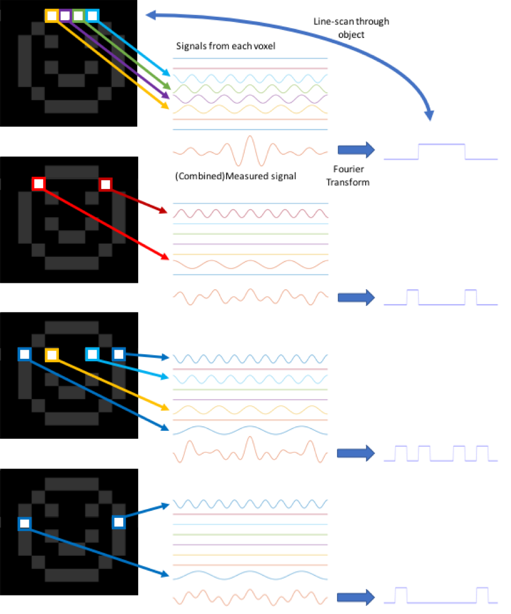
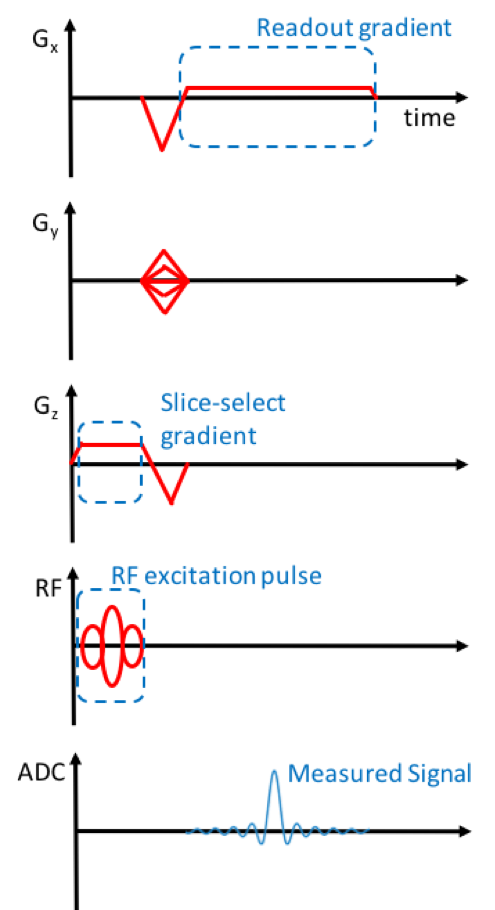
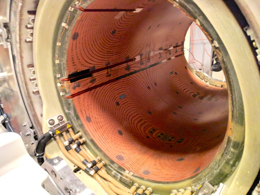

==============
Imaging in MRI
==============

**Warning. May contain some math stuff**
 
The whole of imaging in MRI is based on the Larmor equation,

.. math::

   \omega = \gamma B

It really is. There’s no more physics involved than that. However, there is quite a lot of math. Still, we can defer most of the math for the moment, and explain how we can do a two-dimensional imaging experiment using the concepts of slice selective excitation and frequency encoding. We’ll illustrate the concepts with a hypothetical example of a 2D smiley face, just to keep things nice and friendly.

But don’t we live in a three-dimensional world? Good point. For the moment we’ll just ignore that. The third dimension encodes position with the phase of the MRI signal, phase encoding. This is a bit tricky to explain, so I’ll procrastinate, and justify this as reflecting the historical development of MRI [#]_ .

In our MRI scanner, we have three magnetic field gradient coils that allow us to create magnetic fields that vary linearly in the three spatial dimensions X, Y, and Z. These magnetic gradient fields add to the main static magnetic field B0, which is usually several orders of magnitude greater, such that the magnetic field as a function of spatial location (X, Y, Z) can be written as

.. math::

   B(X,Y,Z) = B_0 + G_X X + G_Y Y + G_Z Z

where :math:`{G_X}`, :math:`{G_Y}` and :math:`{G_Z}` are magnetic field gradients, determined by the amount of electrical current flowing through each of the three magnetic gradient coils. Note that we often switch these gradients on and off sequentially; they are not necessarily all switched on at the same time.

**Direction of the Magnetic Field vs. Direction of the Gradient of the Magnetic Field**

A common misconception is that adding a magnetic field gradient in (say) the X-direction changes the direction of the magnetic field. The magnetic field is always along the axis of the bore, the Z-direction. The magnetic field gradient means that the magnitude of the magnetic field (in the Z-direction) varies with position in the X-direction [#]_ .

  Magnetic field gradients in the X- and Z- directions. The arrows represent the strength and direction of the magnetic field

Slice Selective Excitation
--------------------------

Let’s start by switching on a magnetic field gradient in the Z-direction only (why not start with X? No good reason, except that this will match with convention). In this case, the magnetic field is only a function of Z

.. math::

   B(Z) = B_0 + G_Z Z

If the magnetic field is a function of Z, then so is the Larmor frequency.

.. math::

   \omega (Z) = \gamma (B_0 + G_Z Z)

To emphasize, the resonant frequency of the protons within the body now varies linearly with their location along the Z-axis, as shown. If we now want to excite those protons within a given slice, we need to apply a radiofrequency pulse with just the right range of frequencies to select that particular slice. It is actually reasonably straightforward to generate an RF pulse with a given center frequency and bandwidth (frequency range).

Just to make this a bit more concrete, and to frighten the begeebers out of any math-phobes out there, we will give a realistic example of calculating the center frequency and bandwidth. An almost identical calculation is implemented in the MRI scanner software. We’ll put the calculation in a box so that the math-phobes can safely ignore it.

  **Example of Calculating RF Center Frequency and Bandwidth**

  We are using a 3T MRI scanner, and we wish to excite a 5mm thick slice that is located 40mm from the isocenter of the scanner. During this RF pulse we will apply a magnetic field gradient of 10 mT/m.

  Being careful to use consistent units, including :math:`{\gamma = 42.58}` MHz/T (the proton gyromagnetic ratio) for the center frequency we have

  .. math::

    \omega_{Center} &= \gamma (B_0+G_Z Z) \\
                    &= 42.58 \times 10^6 Hz/T \times (3.0T + 0.010 T/m ×0.040 m) \\
                    &= 127,757,032 Hz

  The bandwidth, Δω can similarly be calculated as

  .. math::

    \Delta \omega &= \gamma \Delta B \\
                  &= \gamma G_Z \Delta Z \\
                  &= 42.58 \times 10^6 Hz/T \times 0.010 T/m \times 0.005 m\\
                  &= 2129 Hz

  The choice of gradient strength in this example was quite arbitrary. For any choice of gradient strength, the same slice thickness can be excited with a suitable selection of bandwidth. In reality the MRI scanner software selects an optimum combination of gradient strength and bandwidth to satisfy various aims and constraints, such as keeping the pulse duration short, and the fidelity of the excitation within acceptable bounds. There are also hardware constraints on both the gradient and RF subsystems, and physiological constraints related to the amount of RF energy to which the body is exposed (Specific Absorption Rate, SAR).

 
Frequency Encoding
------------------

Once we have excited the slice that we want, we now need to figure out where in that slice the signal is coming from. This is done by encoding the spatial location with the phase and frequency of the NMR signal. For the moment we will concentrate on frequency encoding. The final spatial dimension is encoded in the phase of the signal (phase encoding), but we’ll defer that for now.

  **Fourier Transforms**

  Time and frequency are related properties. If we see waves crashing on the beach every two seconds, then the frequency of that wave is 1/2s = 0.5 Hz. Musical instruments such as a guitar string do not just generate a single frequency of sound – if they did, their sound would be uninteresting, and every instrument would sound the same. The richness of musical instruments comes from the additional frequencies (harmonics) accompanying the main (fundamental) frequency.

  If we record the sound from an instrument using a microphone, we can see directly the rapidly oscillating pressure wave that we know as sound. As with MRI, the microphone and analog to digital converter (ADC) record a signal as a function of time. The Fourier transform is a mathematical manipulation that converts a signal as a function of time into a frequency spectrum (signal as a function of frequency). Looking at the frequency spectrum of a guitar string, we can see that the frequency spectrum contains several harmonics, but that the frequencies are related, all being multiples of a single fundamental frequency.

  Another example of frequency manipulation is the graphic equalizer made popular on 1980s boomboxes (perhaps I’m showing my age here). A set of sliders allows the listener to emphasize different frequency ranges. Again, the sound is being generated in the time domain, but is being manipulated in the frequency domain.

Following the slice elective excitation, the magnetic field gradient in the Z-direction is switched off, and replaced with a magnetic field gradient in the X-direction (again, the choice of axes is just convention). As previous, the Larmor frequency varies linearly with position, this time along the X-axis.

.. math::

   B(X) = B_0 + G_X X

so

.. math::

   \omega (X) = \gamma (B_0 + G_X X)

We now listen to the signal being received by our RF receiver coil(s). The signal that we measure will contain a range of frequencies. The signals coming from the left side of the body (X<0) will have lower frequencies than those coming from the right (X>0). However, what we measure is the signal as a function of time (sampling it using an analog-to-digital converter, ADC). However, we can calculate which frequencies are hidden within this signal by calculating its Fourier Transform. The Fourier transform of a signal as a function of time, :math:`{s(t)}` gives us a signal as a function of frequency, :math:`{s(\omega)}`. Since there is a direct, linear relationship between frequency and spatial location along X, :math:`{s(\omega)}` represents the signal as a function of location in X – a line scan through the selected slice. The scaling between frequency and position is determined by the readout magnetic field gradient strength (in our case, the magnetic field gradient is applied along the X-axis, so the frequency is determined by the X-location).

The calculation of what frequency corresponds to what location is essentially identical to the frequency calculation for the transmit RF pulse, except now we measure the frequency and want to calculate the location. To reuse the calculation outlined previously, if we use a readout gradient strength of 10 mT/m, then if we measure a signal at a frequency of 127,757,032 Hz, then this signal must come from an object (or part of an object) located 40mm in X from the isocenter.

  Example of slice-selective excitation and frequency encoding. a. the original two-dimensional object; b. A magnetic field gradient is applied in the z-direction (vertical), such that the resonant frequency is higher at the top of the object and lower at the bottom, indicated by sine waves. Application of a radiofrequency pulse at a high frequency (indicated in red) is on-resonance only with those hydrogen nuclei in the top row of the object. No energy is absorbed by the nuclei that are not on resonance. c. The magnetic field gradient in the z-direction is then switched off and replaced with a gradient in the x-direction (horizontal). The nuclei that had been excited now precess at different frequencies, depending on their location. The measured signal is a sum of the signals from each voxel. Fourier transform of the measured signal results in reconstruction of the signal as a function of location in the excited slice.
 

  Repeating the previous experiment, but exciting a different slice of the object each time (by changing the excitation frequency) allows data to be acquired from the entire object, and an image reconstructed.

  Combining the line scans acquired from each slice, we start to see a familiar shape appear. Converting from signal intensity graphs to greyscale values results in reconstruction of the original image.

 
Pulse Sequences
---------------

It may now be becoming apparent that MRI works through applying a sequence of magnetic field gradients, RF pulses, and signal sampling. Such a set of signals to the various parts of the MRI system is known as a pulse sequence.
There are generally two reactions when a physicist presents a pulse sequence diagram:

* The non-physicists’ eyes begin to glaze over, their mind wanders to what is going to be for lunch, and they wonder why they came to this geek-fest.

* The physicists regard the slide with interest, understanding that this describes almost everything about the presented data acquisition technique. If the sequence is familiar, it is like an old friend (“Ah yes, a T2*-weighted sequence with spiral readout”), while a new sequence invites the question of how does it work, and what contrast does it provide?

An example pulse sequence diagram is shown. You can check your own reaction to these squiggly lines. If you glance at it and immediately recognize a 2D gradient echo sequence, then congratulations, you’re an MRI physicist, and you can probably skip the rest of this section, and possibly this entire book. For the rest of us, I’ll try to explain what the diagram represents, and how to “read” this arcane language of the MRI scanner.

  An example of an MRI pulse sequence. Scary, isn’t it? Highlighted are (a) the slice-select gradient on the Z-axis, (b) the RF excitation pulse, and (c) the readout gradient on the X-axis. All that other stuff will be explained later. Signals on Gx, Gy, and Gz indicate the magnetic field gradients are applied on the corresponding axes. Those in the know will recognize this as a 2D gradient echo acquisition. On a real MRI scanner, you can often connect an oscilloscope to the scanner and see these waveforms being generated.

Physicists are very keen on pulse sequence diagrams, but actually for good reason, and not simply because it tends to provoke fear and admiration [#]_ from the non-physicist population. I’ll let you into that secret now. Programming an MRI machine is easy. Shhh… don’t let the secret out. There are only a small number of basic components of an MRI scanner.

Components of an MRI Scanner
----------------------------

* A big magnet providing a strong, uniform, static magnetic field. We have no control over this magnet, except perhaps that big red button [#]_. 

* Three magnetic field gradient coils, that allow us to make the magnetic field vary linearly in X, Y and Z. We can specify the magnetic field gradient we need, and the scanner will send the right amount of current through each coil to make the required gradient.

* A radiofrequency (RF) transmitter, composing of a big RF amplifier and an RF transmit coil (often but not always built in to the bore of the scanner). We can specify a waveform to be output to the transmitter, determining which frequencies are transmitted (for example, the center frequency and bandwidth).

* A radiofrequency (RF) receiver, composing an RF receiver coil (or array of coils) and the associated electronics to sample the signal. We can decide when to switch the sampling on and off, some analog filters that are applied prior to sampling, and the rate at which we sample data.

  MRI gradient coils generate magnetic field gradients in X, Y, and Z. These are often referred to as fingerprint coils, for fairly obvious reasons.

That’s it. Only four components, one of which we have no control over (the main magnetic field), and one of which we can only switch on and off, and some other minor tweaks (the RF receiver). All we can do with our hugely expensive MRI scanner is to send waveforms to four generators [#]_ (three gradients and one RF). A pulse sequence diagram tells you what signals are sent, and their timing. This describes everything about how the scanner acquires data, and varying these four waveforms gives us the amazing richness of contrasts that MRI can generate. The four signals are conventionally labeled Gx, Gy, Gz for the X, Y, and Z magnetic field gradients, and RF.

Isn’t it amazing that MRI physicists are paid to think up and implement new combinations of these four waveforms? Hopefully you already understand some parts of this diagram. When you understand the rest, then you - the apprentice - will have become the master of MRI!

.. rubric:: Footnotes

.. [#] The initial development of MRI “borrowed” its reconstruction techniques from computed tomography (CT). A series of projections through the object at different angles was used to reconstruct a tomographic slice using the Radon transform. Cartesian imaging using phase encoding for the third dimension rapidly dominated the field, although radial imaging is used in some specialist applications such as ultrashort TE imaging.

.. [#] To be really, really pedantic (and I am something of a pedant), according to Maxwell’s equations the divergence of the magnetic field must be zero – equivalent to saying that there are no magnetic monopoles – so creating the gradient in Z must create a field in another direction. The flux lines have to come from somewhere. In practice, these Maxwell fields are so small as to be negligible.

.. [#] I may be being delusional here.

.. [#] Pressing this button results in the rapid loss of magnetic field to enable the release of anyone unfortunate enough to be trapped in the MRI scanner by some ferromagnetic object that was inadvertently brought into the scan room. Adverse side effects of this “quench button”, is that the MRI scanner will be unavailable for service for quite a while, and that hundreds or thousands of liters of liquid helium rapidly leave the scanner through a vent in the roof, providing an interesting spectacle for observers outside (a bit like one of those smoke machines that they use a discoes – I gather, remember, I’m a physicist - but much larger and very much colder). Since the cost of liquid helium is about the same as whisky (although not that of a good single malt), loss of employment is a further potential side-effect.

.. [#] Strictly, the RF generator can vary its magnitude and phase, so sometimes two waveforms are used to control it. Likewise the times when the signal sampling is switched on and off is often marked on a pulse sequence diagram.

