====================
k-Space without Math
====================

  **What is k-Space?** *k-space is the 2D (or 3D) Fourier transform of image space*

The above statement is completely true while at the same time being almost completely unhelpful. We’ll try to use illustrations to get a feel for what k-space actually represents. In the figure below, we see an image and its corresponding representation in k-space.

.. table:: Image space (left) and k-space (right). The k-space image is on a logarithmic scale to enable visualization of structure in the outer parts.

  ================================== ==================================
  .. figure:: images/image-space.png .. figure:: images/k-space.png
  ================================== ==================================

What you may immediately notice is that the signal in k-space is concentrated in the middle (‘the center of k-space’). This is almost always the case. In fact, the k-space image is shown on a logarithmic scale. On a regular linear scale, it would just look like a single dot, and we wouldn’t be able to see that there is structure outside the center.

Perhaps unknowingly, you have almost certainly used this concentration of signal in k-space. When you take a photo with a digital camera, the JPEG file format coverts your image into k-space, which can then be very effectively compressed due to the very low signals outside the center.

Going from image space to k-space isn’t just a one-way street. If k-space is the Fourier transform of image space, then image space is the inverse Fourier transform of k-space. We can use the inverse Fourier transform to demonstrate what each point (pixel) in k-space represents.

Start with a point 8 pixels above the center of k-space. When we inverse Fourier transform this point, we end up with an image that looks like a horizontal wave. Not coincidentally, there are 8 full waves from top to bottom. Let’s do the same experiment with a point 4 pixels vertically from the center. Again, there’s a horizontal wave, and this time there are 4 full waves from top to bottom (can you spot the pattern?).

We’ll do the same thing, but with 4 pixels to the right of the center. This time, the waves run from left to right. What about a pixel 4 to the right and 4 up? This time we end up with a diagonal wave.

Each pixel in k-space represents a certain “spatial frequency” or wavelength and direction. In you remember a little bit of high school physics, you might recall that the wavelength of a sound is inversely related to its frequency. While with sound, frequency has units of Hz, or s-1, in imaging, spatial frequency has units of cm-1, or waves per centimeter. A spatial frequency of 2cm-1 has 2 waves per centimeter, or a wavelength of ½cm.

The Fourier transform is called a linear transformation, which means that adding two signals in k-space results in a signal in image space being the sum of the waves that the signals would have generated individually. These waves interfere with each other (like a diffraction pattern that you may have seen in a physics class). If we add together vertical and horizontal waves, for example, we end up with a grid-like pattern.

Any image can be made up of a suitable sum of waves of a range of spatial frequencies and directions. This is just the two-dimensional equivalent of decomposing a sound into its component frequencies, which is the basis of audio compression formats such as MP3 files.

You may now be wondering which this interesting (or perhaps not-so-interesting) discussion of Fourier transforms and spatial frequencies has to do with MRI. Patience, all (or at least some) of this will be revealed in the next section.

.. table:: k-space and the corresponding image-space waves. White regions correspond to the peak of the wave and black the tough. The distance from the origin (marked with a cross) in k-space corresponds to the spatial frequency with the angle determining the direction of the wave.

  ======================================== ========================================
  .. figure:: images/kspace-0-8.png        .. figure:: images/kspace-0-8-image.png
  .. figure:: images/kspace-0-4.png        .. figure:: images/kspace-0-4-image.png
  .. figure:: images/kspace-4-0.png        .. figure:: images/kspace-4-0-image.png
  .. figure:: images/kspace-4-4.png        .. figure:: images/kspace-4-4-image.png
  ======================================== ========================================

.. table:: Adding two points in k-space corresponds to adding the two waves in image-space due to the linear nature of the Fourier transform.

  =========================================== ===========================================
  .. figure:: images/kspace-2points.png       .. figure:: images/kspace-2points-image.png
  =========================================== ===========================================

.. table:: Progressively forming an image from a sum of waves of different spatial frequencies. The images are formed from grids of 3x3, 5x5, 7x7, 17x17, and 33x33 spatial frequency components.

  ======================================== ========================================
  .. figure:: images/k-image-3x3.png       .. figure:: images/k-image-5x5.png
  .. figure:: images/k-image-7x7.png       .. figure:: images/k-image-17x17.png
  .. figure:: images/k-image-33x33.png      
  ======================================== ========================================

 
Another View on What we Measure with MRI
----------------------------------------

We have already discussed the imaging aspect of MRI in terms of frequency encoding and phase encoding. The description that follows is not inconsistent with the previous description, it just rolls them both into a single framework, based on the combination of signals from different parts of the object.

  *The signal that we measure in MRI is the sum of all the signals from the protons within the object, accounting for their phase. The phase of a particular proton is determined by the magnetic field that it has experienced, its “magnetic history”.*

What is the effect of switching on a magnetic field gradient to the signal that we measure? It is to speed up the precession of protons on one side of the isocenter, and to slow down those on the other. Over time, the protons that speed up will have an increased phase, while those that slow down will have a decreased phase (relative to those unchanged at the isocenter). This results in a signal phase that varies linearly across the object. This “phase ramp” accumulates – gets bigger - while the gradient is switched on. Phase is cyclic, so a phase of 2 \pi radians (or 360 degrees) is equivalent to a phase of zero. This results in a series of peaks (positive signals) and toughs (negative signals) across the object.

Initially, we assume that all the protons are in phase, so their signals all add together nicely, giving a strong combined signal. After only a short amount of time, the signal across the image consists of signal peaks and toughs. At this point, the regions of peaks and toughs largely cancel each other out, and there is very little signal. This is telling us that there is very little signal contribution at these spatial frequencies. To emphasize again, the signal that we actually measure is just a sum of all the signals from the protons in the object, accounting for their phase.

What we are actually doing here is sampling k-space, starting at the center and (in the case of a positive magnetic field gradient in the x-direction) moving to the right. The spatial frequency that we measure at a particular point in time depends of the strength of the magnetic field gradient, its direction, and how long it has been on.

.. table:: Effect of a magnetic field gradient in the x-direction on the phase across the object as a function of time. Initially it is assumed that all the protons are in-phase (white). Over time, the gradient produces a linear phase ramp resulting in alternating peaks (where the phase is a multiple of 2 pi, or 360 degrees), and toughs of a wave.

  =========================== =========================== ===========================
  .. figure:: images/Gx-0.png .. figure:: images/Gx-1.png .. figure:: images/Gx-2.png
  .. figure:: images/Gx-3.png .. figure:: images/Gx-4.png .. figure:: images/Gx-5.png
  .. figure:: images/Gx-6.png .. figure:: images/Gx-7.png .. figure:: images/Gx-8.png
  =========================== =========================== ===========================

If we now switch off the gradient in the x-direction, and switch on a gradient in the y-direction, we start to introduce an additional phase ramp in the y-direction. This combines with the first phase ramp to eventually generate a diagonal phase ramp. In terms of k-space, we came to an abrupt halt in the x-direction, and are now traveling in the y-direction.

.. table:: Effect of applying a magnetic field gradient in the y-direction immediately after applying the x-gradient in the previous figure.

  ============================== ============================== ==============================
  .. figure:: images/Gxy-8-0.png .. figure:: images/Gxy-8-1.png .. figure:: images/Gxy-8-2.png
  .. figure:: images/Gxy-8-3.png .. figure:: images/Gxy-8-4.png .. figure:: images/Gxy-8-5.png
  .. figure:: images/Gxy-8-6.png .. figure:: images/Gxy-8-7.png .. figure:: images/Gxy-8-8.png
  ============================== ============================== ==============================

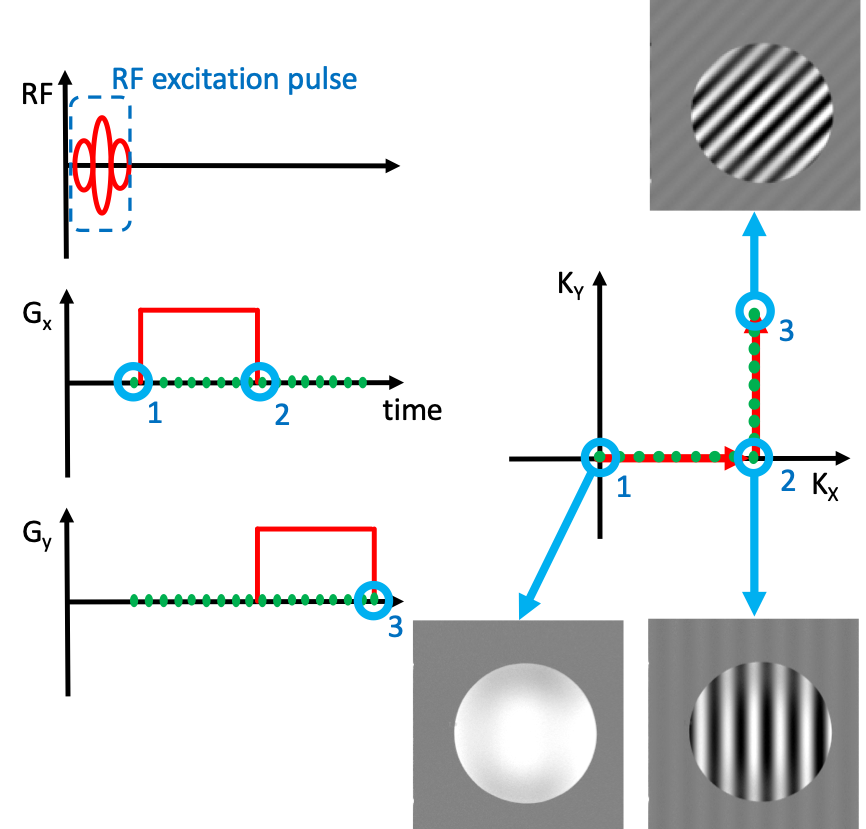

  A simple pulse sequence consisting of an RF pulse followed by magnetic field gradients along the X- (1-2) and then the Y-direction (2-3). The corresponding trajectory through k-space and the phase induced across the object are shown.

MRI Pulse Sequences
-------------------

What we have done in this experiment is to create a simple sequence of two magnetic field gradient pulses, in addition to an initial RF excitation pulse. This is known as a pulse sequence. Measuring the combined signal from all the protons during the gradient pulses enables us to sample k-space. If we can sample the whole of k-space in this way, then all we need to do to reconstruct an image is to apply the inverse Fourier transform to our fully-sampled k-space. 

 
A Realistic Pulse Sequence – Gradient Echo
------------------------------------------

The principles that we have just outlined in a simplified pulse sequence can be directly applied to a real pulse sequence – a “gradient echo” sequence – which can be used to acquire real imaging data.
We now introduce the first two of our rules for k-space:

  We start in the middle of k-space, with all the protons in-phase with each other (kx = ky = 0)

  Applying a magnetic field gradient in a given direction introduces a phase ramp in that direction. The magnetic field gradient direction and strength determine the direction and speed (the velocity) with which we traverse k-space

We’ll now analyze the gradient echo pulse sequence in terms of k-space.

Slice Selective Excitation and Slice Rewinder
---------------------------------------------

As we’ve seen before, to selectively excite a particular slice, we have to apply a magnetic field gradient perpendicular to the slice, and apply an RF pulse with an appropriate center frequency and bandwidth to select the correct location and slice thickness respectively.

That explains why we have the positive gradient in the z-direction during the RF excitation, but why is it followed by a negative gradient? During the RF pulse, the Z-gradient is also creating a phase ramp along the Z-direction; we have moved away from kZ = 0. To bring us back to the center of k-space, we add another gradient, in the opposite direction. If the pulse is symmetric, then the phase ramp effectively starts in the middle of the RF pulse. To counteract the dephasing, the “rephaser” gradient should have half the area of the slice select gradient (the amount of dephasing and rephrasing depends on the product of the gradient strength and time, the area under the curve).

Phase Encoding
--------------

Switching on a magnetic field gradient in the Y-direction moves us in the positive kY direction to get us set for sampling a particular line of k-space in kY. To select a different value of kY, we usually just change the amplitude of this phase encode gradient from one acquisition (TR) to the next. We could equally well change the duration, but in practice, keeping the duration constant makes it easier to have consistent timing (for example, the same TE).

Frequency Rewinder and Readout
------------------------------

Before we start sampling our line of k-space in X, we use a negative gradient in X to set our start location, so that we can sample a line starting on the left (kX<0), going through the middle (kX=0), and finishing on the right (kX>0). This way we can measure both negative and positive values of kX in a single acquisition, and we have no issues of discontinuities when we switch on and off our sampling. We start with very little signal when kX is large and negative, the signal increases as we head to the middle of k-space (kX=0), and the signal decreases as kX becomes large and positive.

For a “symmetric echo”, the area of the rewinder is half the area of the readout gradient, such that the center of k-space (kX=0) is reached halfway through the readout. Usually the amplitude of the readout gradient is a lot smaller than that of the rewinder. This is because we want to get to the start as quickly as possible, to allow us to use a very short echo time if we want, but acquiring our line of k-space in a more pedestrian manner allows us to average our signals over a longer period of time, giving a higher signal-to-noise ratio (SNR).

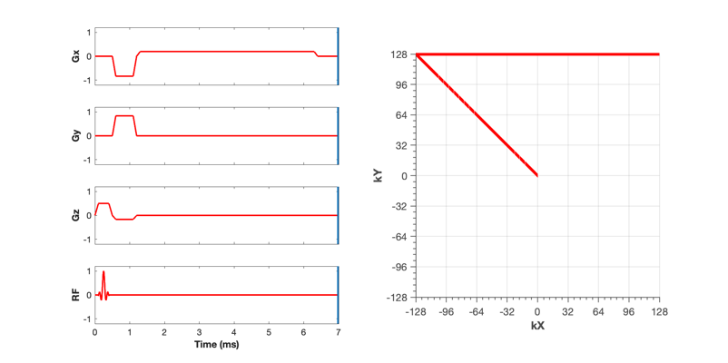

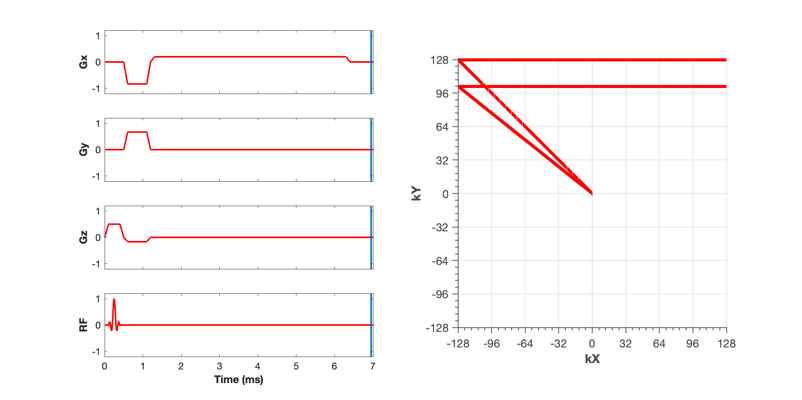

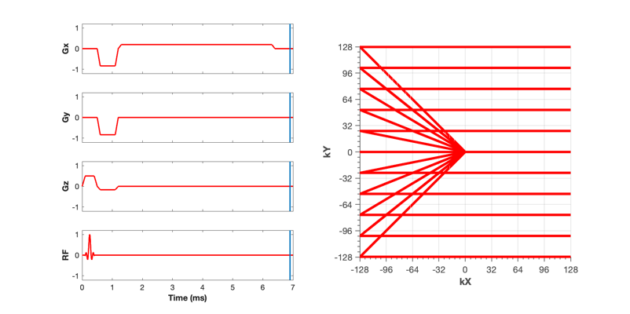

  Gradient echo pulse sequence. Each acquisition (TR) fills in a single horizontal line in k-space. The amplitude of the phase encode gradient (y) is varied from acquisition to acquisition to acquire a particular line of k-space.

Spin Echoes
-----------

As we have seen before, a 180 degree RF pulse inverts the phases of all the spins. In k-space, this just means that we are instantly transported to the opposite position in k-space. With a spin echo acquisition, the frequency rewinder and phase encodings are usually applied prior to the spin echo (when there’s little else to do), and have inverted amplitudes compared to the gradient echo sequences. A positive X-gradient prior to the spin echo takes us to the far right of k-space, but the spin echo then flips us back to the far left of k-space, ready for our readout gradient.

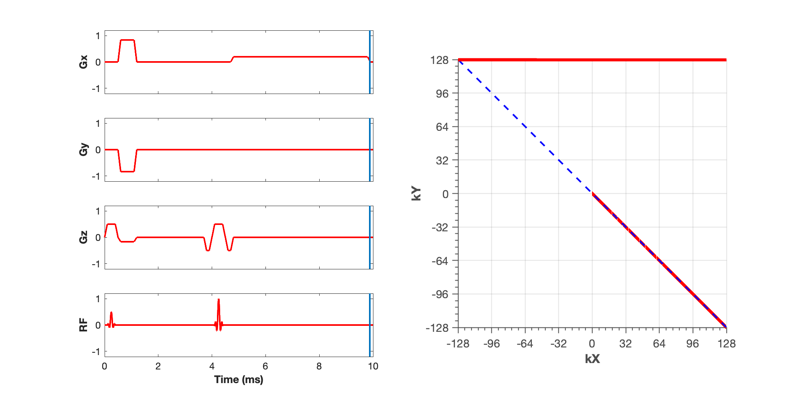

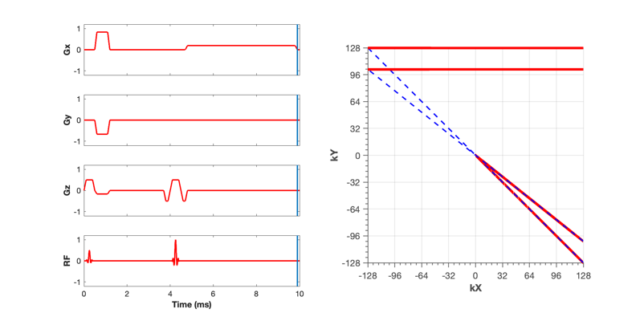

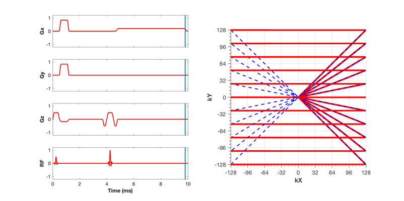

  Spin echo pulse sequence. As with the gradient echo, each acquisition (TR) fills in a single horizontal line in k-space, and the amplitude of the phase encode gradient (y) is varied from acquisition to acquisition to acquire a particular line of k-space. The spin echo transports us to the opposite position in k-space (blue dashed lines).

Animated Pulse Sequences
------------------------

Animations showing the traversal of k-space during different pulse sequences can be found at the following link. As you watch them, remember the road rules for k-space: We start in the middle of k-space, and the strength and direction of the magnetic field gradient determines our velocity in k-space at each point in time.

Gradient echo
https://www.dropbox.com/s/xdnkjj4hgg79dia/GradientEcho.mov?dl=0

Gradient echo EPI (as used for BOLD imaging)
https://www.dropbox.com/s/4t2j6x84g8ua7yl/GE-EPI.mov?dl=0

Radial sampling
https://www.dropbox.com/s/ckw6m21x9e5aihc/Radial.mov?dl=0

Spiral imaging
https://www.dropbox.com/s/gpbw16okaka5qdl/Spiral.mov?dl=0

Spin Echo
https://www.dropbox.com/s/sbqt2iblvcx7y0k/SpinEcho.mov?dl=0

Spin Echo EPI (used in diffusion imaging)
https://www.dropbox.com/s/ah0exr9qjoy5hn9/SE-EPI.mov?dl=0

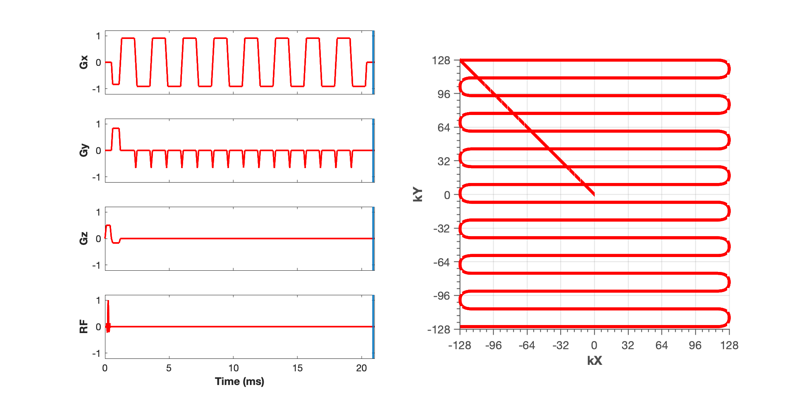

  Single-shot gradient echo EPI (echo planar imaging) allows us to acquire the whole of k-space following a single RF excitation. The alternating read encode (x) gradients sweep back and forth in kX, while the phase encode blips (y) allow us to slowly move down in kY.

 
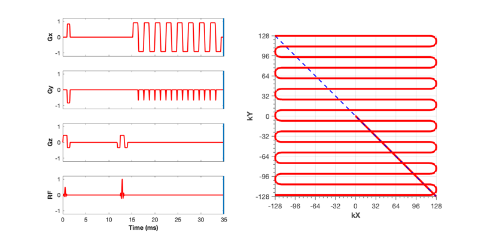

  Single-shot spin echo EPI is very similar to the gradient echo EPI, except that a spin echo is used to transport us to the starting position for the EPI readout.

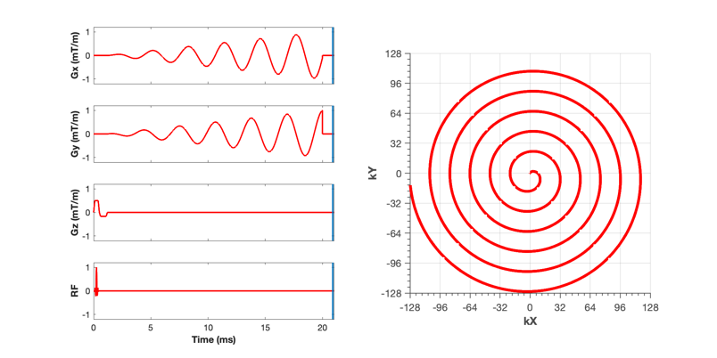

  Similar to gradient echo EPI, spiral k-space sampling enables complete sampling of k-space follow a single RF excitation. Reconstructing the images is a bit more complicated because k-space is not sampled on a regular (cartesian) grid. This is called non-cartesian sampling, and has some advantages and some disadvantages compared to regular EPI.

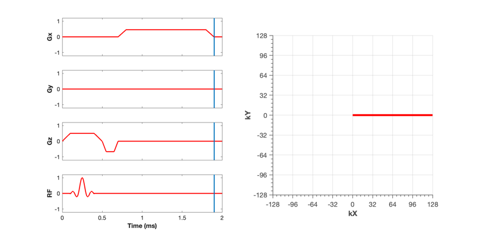

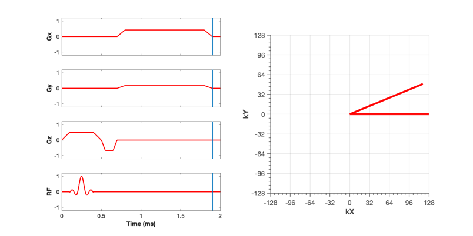

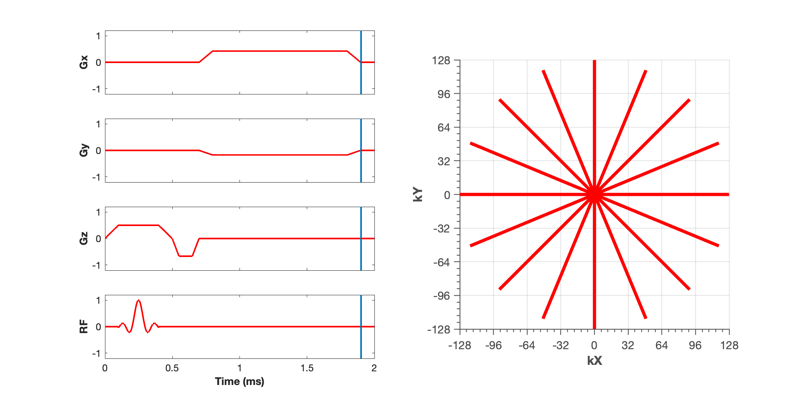

  Radial imaging is another type of non-cartesian sampling of k-space. Like a regular gradient echo, each radial line is acquired in a separate TR. The larger density of samples acquired close to the center of k-space (oversampling) provides for a reduction in sensitivity to motion, which partly averages out in this critical region.

 
 
